# Big-O Notes

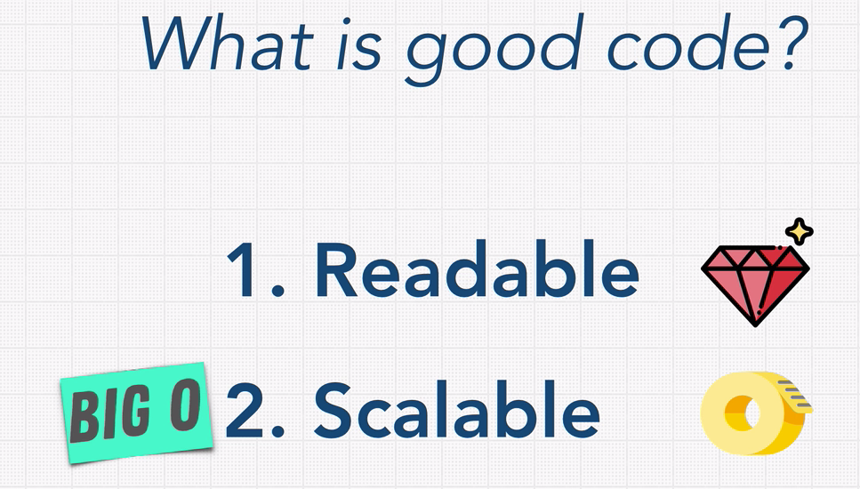
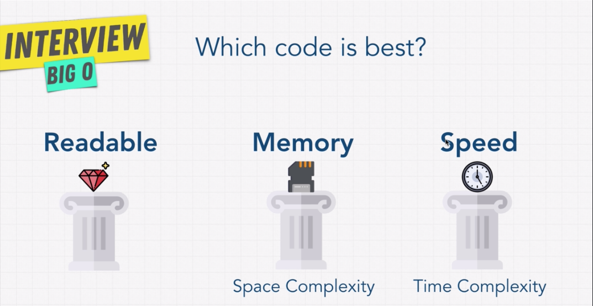

## Big-O Rule Book

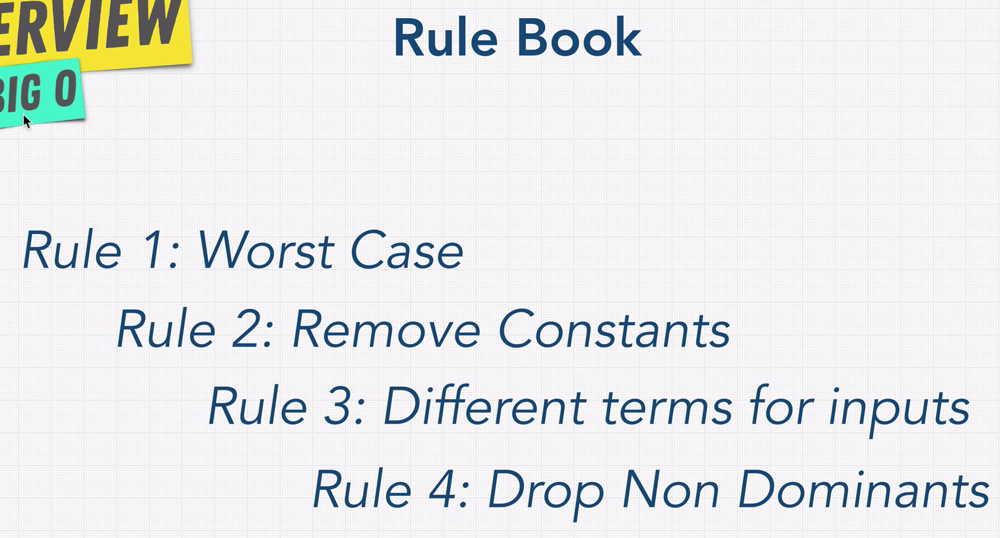

1. Big-O only cares about the worst case.

2. Remove Constants\
   Example Code: 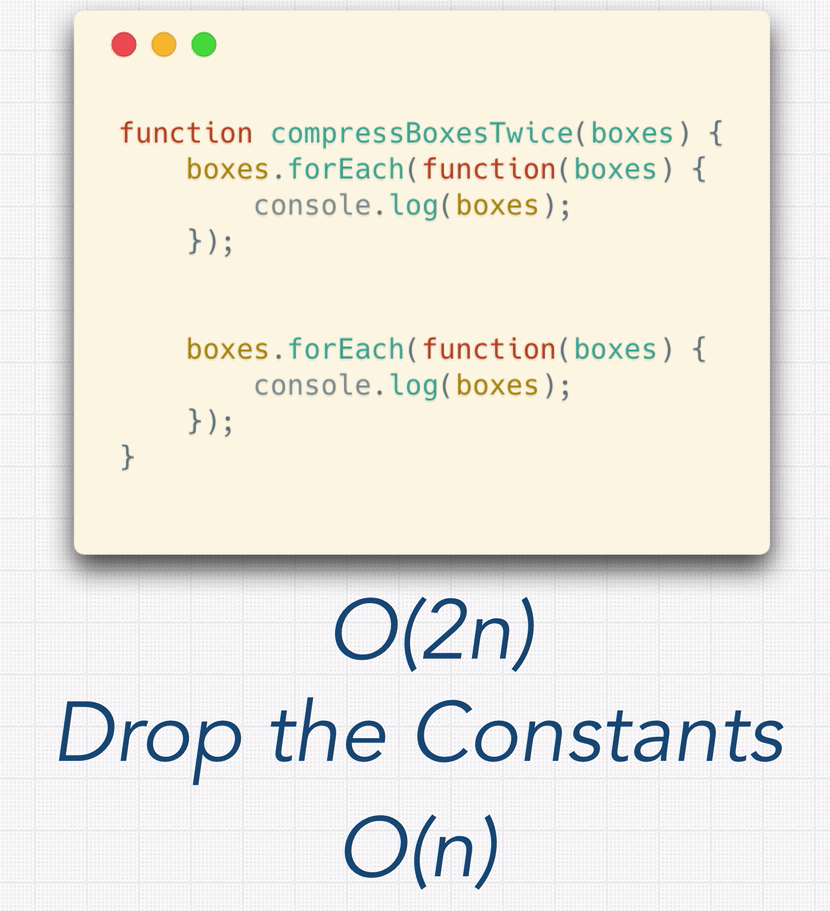

3. Different terms for inputs\
   Example Code: 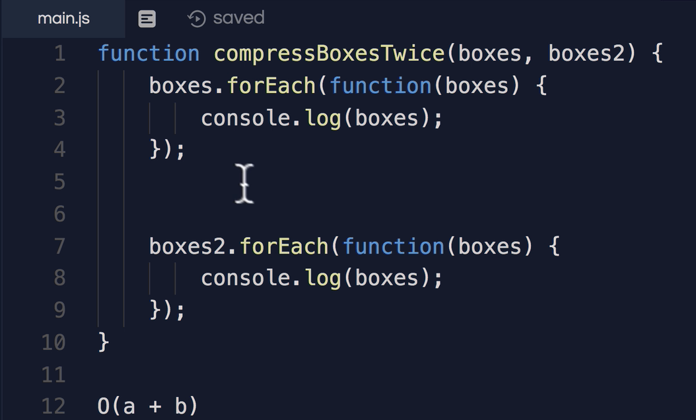

## O(n) - Linear Time

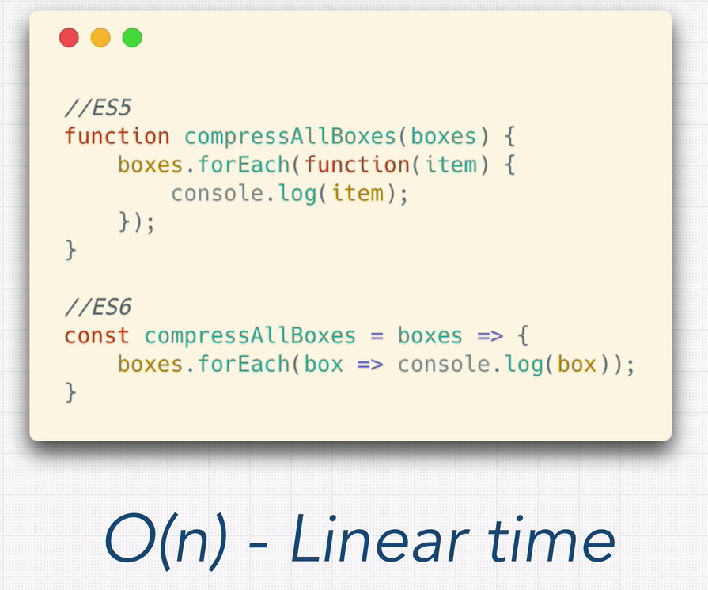

## O(1) - Constant Time

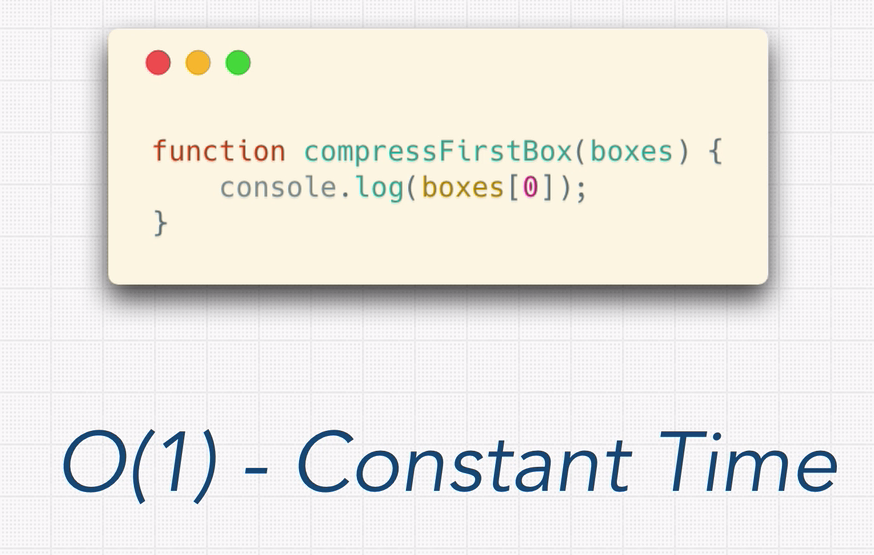

1. Example code: 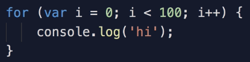

## O(n^2) - Quadratic Time

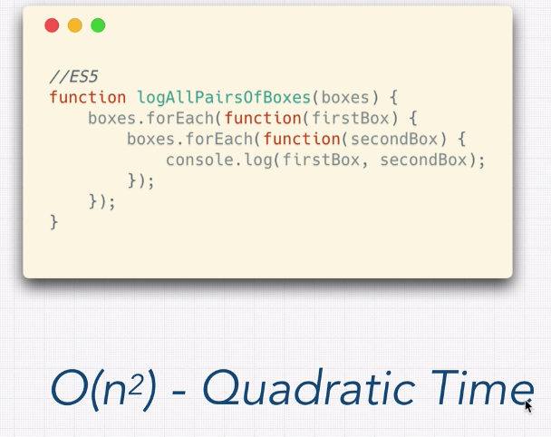

1. Example code: 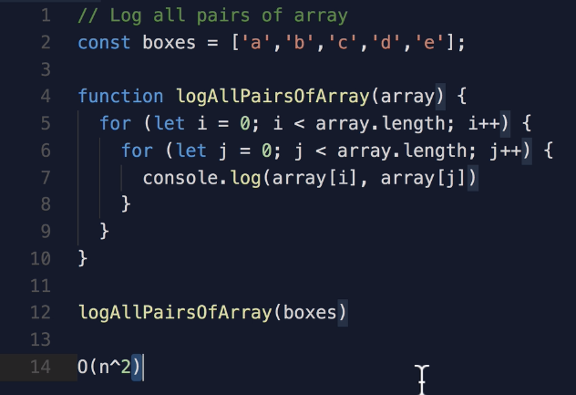

2. Different Inputs: 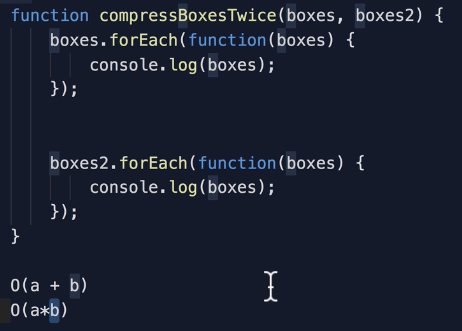

## O(n!) - Factorial\

1. Adding a loop for every element.

## Space Compexity

1. What causes Space complexity?
   1. Variables
   2. Data Structures
   3. Function Call
   4. Allocations
